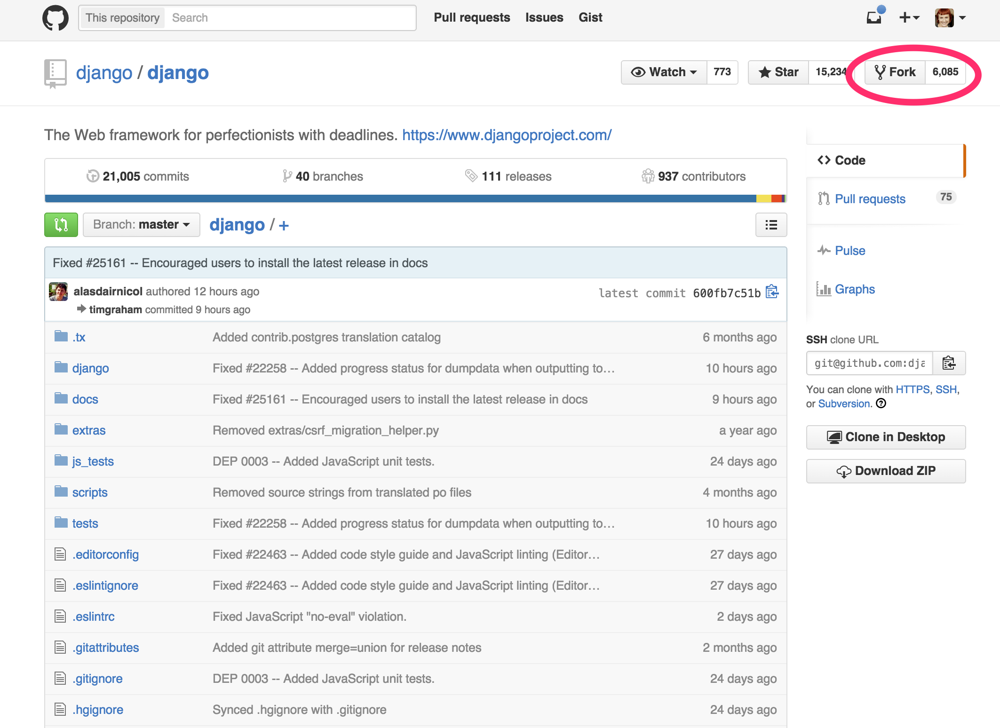
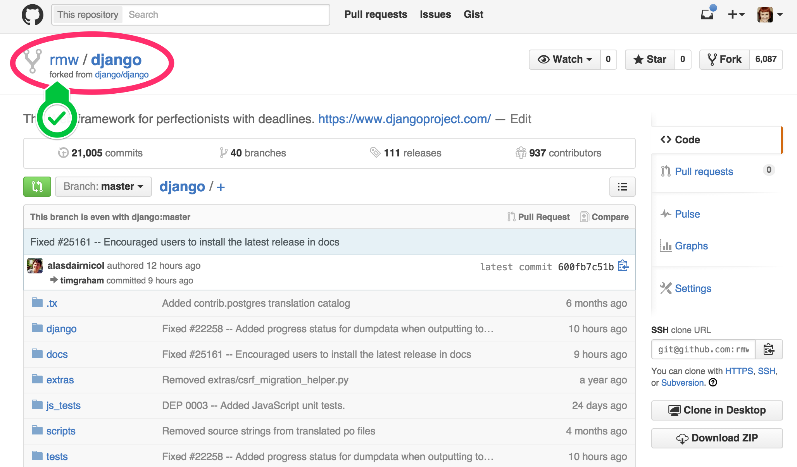
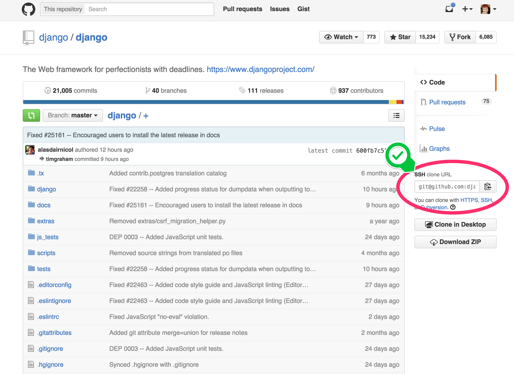
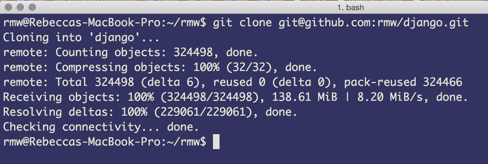
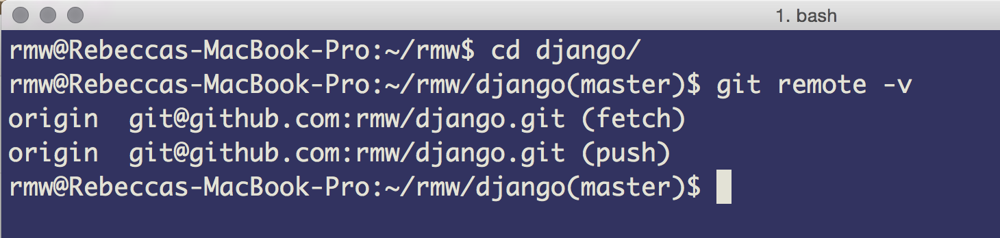
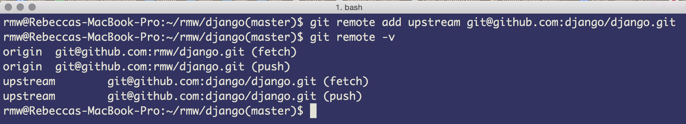

# Getting Started in Open Source!

1. [Set up git & Github](#git-and-github)
- [Clone your project](#clone-your-project)
- [Set up a project](#set-up-a-project)
- [How Tos](#how-tos)

## Git and Github

- [Get started with Github](#get-started-with-github)
- [Git basics](#git-basics)
- [Git rebase](#git-rebase)

### Get Started with Github

* Create a [Github account](https://github.com/join)
* [Set up Git](https://help.github.com/articles/set-up-git/)
* [Generating ssh keys](https://help.github.com/articles/generating-ssh-keys/)

#### More Resources
* [Try Git](https://try.github.io/levels/1/challenges/1)
* [Github for beginners series](http://readwrite.com/2013/09/30/understanding-github-a-journey-for-beginners-part-1)
* [Git website](https://git-scm.com/)
* [Github Bootcamp](https://help.github.com/categories/bootcamp/)
* [Github Guides](https://guides.github.com/)

#### Jargon
<dl>
<dt>Branch</dt>
<dd>A version, or draft, of the code. `master` is the default branch.</dd>
<dt>Pull</dt> 
<dd>Download code from another repository or from a branch</dd>
<dt>Push</dt>
<dd>Send your newly written code to another remote repository</dd>
<dt>Remote</dt>
<dd>A link to a git repository on another server. By default, “origin” is the remote created when you run `git clone`.  “upstream” is the term used for the source, or original, repository’s remote.</dd>
<dt>Repository</dt>
<dd>Your code base.  Can be thought of as the directory with all your code in it.</dd>
<dt>Version control<dt>
<dd>Application that stores code, allows multiple coders to work on the same code base and tracks the history of code changes.</dd>
</dl>

### Git Basics

See history of code changes
```
git log
```

See the current status of files. *Tracked* or *staged* files are ready to be committed. *Untracked* files will not be committed.
```
git status
```

*Stage* files, or tell git that you want this file to be included into the next commit
```
git add <FILE NAME>
```

Commit currently staged files
```
git commit
```
*Note: by default, git will use vim as the text editor for commit messages*
Helpful vim commands:
- *i* - go into “edit mode” where you can type normally
- *esc* - exit edit mode
- *:w* - “write” or save the changes
- *:q* - quit the editor
- *:q!* - quit without saving

Push your changes to a remote repository
```
git push
#if it’s the first time you are pushing a branch
git push -u origin head
```

Pull changes from a remote repository
```
git pull <REMOTE NAME> <BRANCH NAME>
git pull origin master #pulls from my fork
git pull upstream master #pulls from source repo

#Use “rebase” instead of the default merge
git pull --rebase upstream master
```

Create a new branch
```
#short cut
git checkout -b <BRANCH NAME>

#long way
git branch <BRANCH NAME>
git checkout <BRANCH NAME>
```

Checkout or switch to a different branch
```
git checkout <BRANCH NAME>
#e.g.
git checkout master
```

### Git Rebase

Rebase puts your changes (from the repository you are in when you run the command) *on top* of changes that are pulled, regardless of when the changes were made.

Merge, on the other hand, tries to combine the commits in chronological order.

#### Pull with rebase

```
git pull —rebase <REMOTE NAME> <BRANCH NAME>
git pull —rebase upstream master
```

#### Fix conflicts with rebase

See the files with conflicts
```
git status
```

**Fix the code in those files**
You will see things like `<<<<HEAD` which indicate the sections that conflict between the two repositories

Once you’ve fixed the code
```
git add <FILE NAME> 
git rebase --continue
```

**DO NOT commit changes**

#### Abort the pull/rebase

This will rollback *all* code changes

```
git rebase --abort
```

## Clone your project

### Fork Project on Github

[]

You should be redirected to the fork on your Github account.

[]

### Clone your fork

#### Find the SSH url of your fork on Github

[]

#### Clone the repository

```
git clone git@github.com:rmw/django.git
```

You should see something like this
[]

### Change to repository directory

Go into the directory with the code and check the remotes created by `git clone`.

```
cd django
git remote -v
```

You should see something like this
[]


### Add “upstream” remote
This is the reference to the source, or original, repository.

```
git remote add upstream git@github.com:django/django.git
```

You should see something like this
[]

## Set up a project
- Follow set up instructions
- Install dependencies
- Run the code
- Run the tests

*This may very well be the opportunity for your first pull request!*


## Contribute

First, add a note on the issue/ticket saying that you are going to work on it so the maintainer and others know. 

Create issue/ticket if one doesn’t exist.

### Create a branch for the issue
```
git checkout -b <FEATURE NAME>
```

*Follow any branch naming conventions outlined in the contributing docs*

### Code

Write tests.
Follow code style guides and code conventions you see in the code base.

### Commit your code
Fix and commit one thing at a time. Write a clear, descriptive commit message.


### Push branch to your fork
```
git push -u origin head
```

### Create a Pull Request
Write a clear description in the pull request.
Link to the issue/ticket in the pull request.

If don’t finish or not the maintainer is not using Github issues, post an update to the issue/ticket.

## How Tos
* [How to get help](#how-to-get-help)
* [How to search the internet](#how-to-search-the-internet)
* [How to write good code](#how-to-write-good-code)
* [How to debug](#how-to-debug)
* [How to write a bug report](#how-to-write-a-bug-report)
* [Good commit messages](#good-commit-messages)
* [Before you create a pull request](#before-you-create-a-pull-request)
* [How to do a code review](#how-to-do-a-code-review)

### How to get help

* Ask your peers
* Ask a mentor
* Ask the internet

### How to search the internet
- What version? How recent?
- Google
- - Look at most recent results first
- StackOverflow
- - Look at many answers

*Pro tip: document your errors and solutions*

### How to write good code
- Follow coding standards that you see (naming, indentation, etc)
- Look at code style guide if its linked
- Self-documenting code - don’t be clever, be clear
- Get feedback
- Fix and commit ONE thing at a time

### How to debug
- Read the error message (if there is one)
- Isolate the error — find the exact line — using a debugger or print statements
- What is the input? What is the output? Is it what you expect it to be?
- Google the error message
- Delete things until the code works again.

### How to write a bug report
- the exact error you are getting, including the error message
- detailed repeatable steps for the error
- - what did you click on? did you click, tab, press enter, or hit another key?
- - what page did you start on? what page did you end up on?
- details of where & what you are working on, including the version
- - browser,  operating system, device, language
- screenshots of the error

### Good commit messages
- Short summary for first line (50 chars)
- Word wrap (72-80 chars)
- One commit per change
- Answer:
- - Why is this change necessary?
- - How does it address the issue?
- - What side effects does it have?
- Include link to issue/ticket and external sources

### Before you create a pull request

- Run ALL tests
- Get a Code Review
- Pull from upstream

### How to do a code review

- Read the issue/ticket
- Review contributing guidelines & code style guides
- Be thorough & give yourself time
- Focus on the code not the author
- Ask questions
- Run the Code
- Sign off & hi-five!